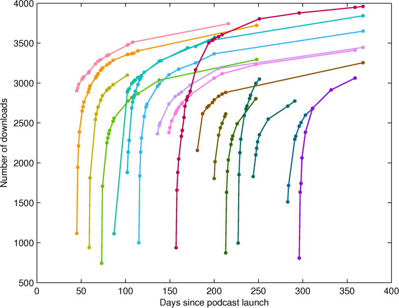
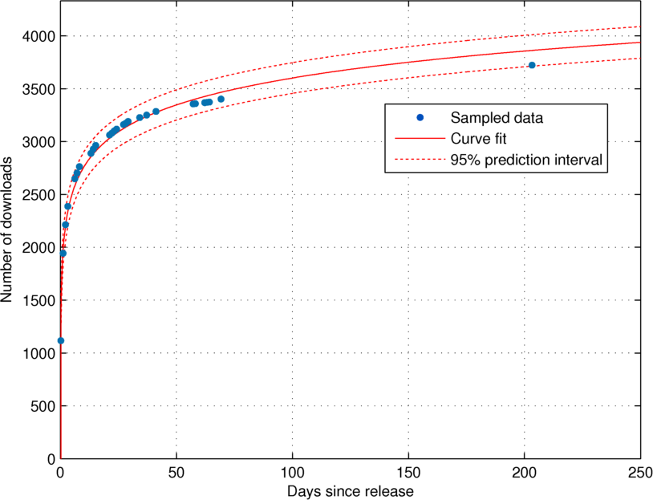
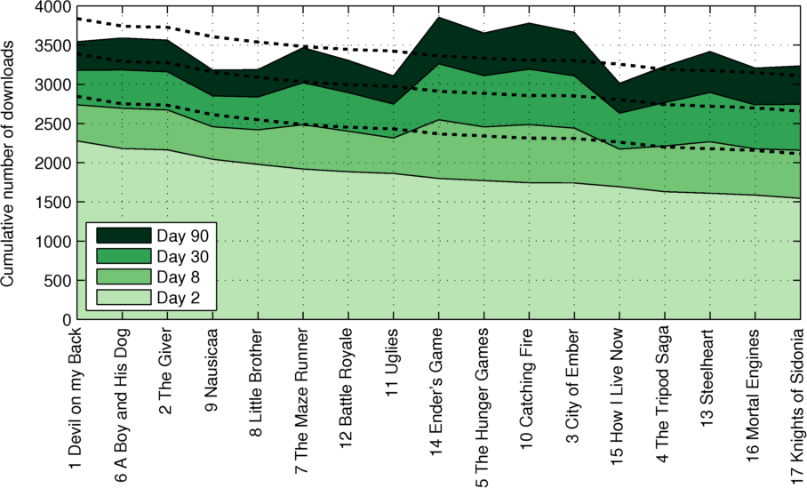
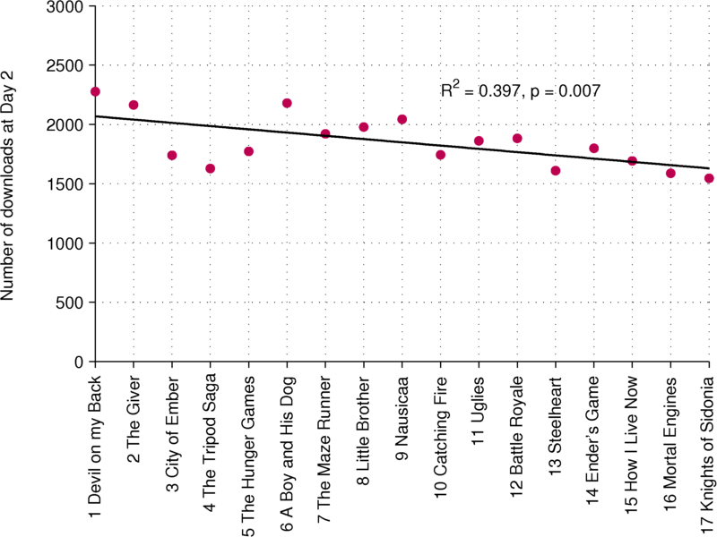
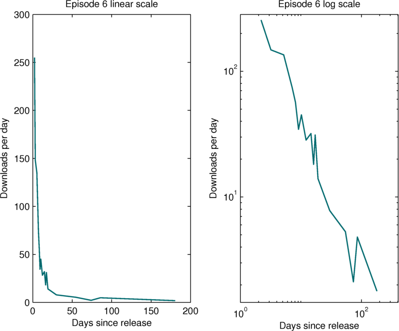
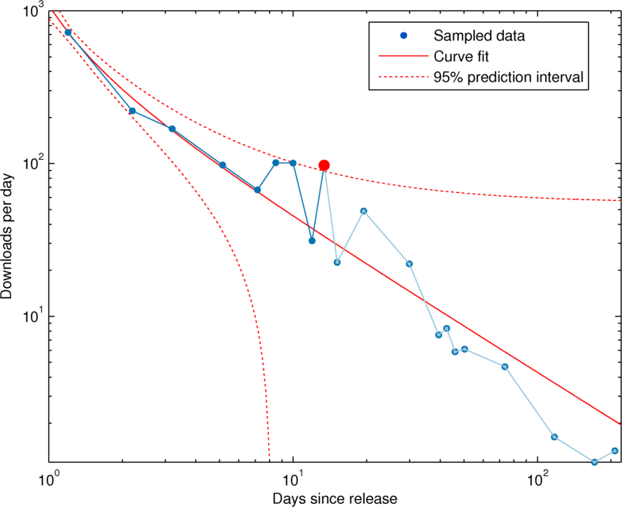

# Fight the Future with Dan and Paul Podcast Download Analysis

[Fight the Future on iTunes](https://itunes.apple.com/us/podcast/fight-future-loadingreadyrun/id981185349?mt=2)

--------
Hi Paul, as you know I've been thinking a lot about how to analyze our episode download numbers, and what they can tell us about how we're doing. There are three major questions that interest me:

1. Are some episodes more popular than others?
2. Is our podcast getting more popular with time?
3. Can I identify spikes in episode downloads, that might be due to external factors?

There are also views on YouTube, which would be interesting to look at, but a greater number of people heard it as a podcast.

## Are some episodes more popular than others?

I used the data on number of downloads from the archive.org pages we hosted them on, sampled at somewhat arbitrary intervals (because I was doing it by hand, for fun). Here are all my data points over time, with each colour representing a different episode:

As you can see, each episode follows a curve of sharp growth, followed by a rapid slowing down of downloads until it's just a trickle. This is probably largely because of the most common means of delivery of podcasts: automatic download of the new episode by podcasting software, whenever it is activated. People seeking out older episodes and downloading them specifically will always be rarer, especially after a lot of time passes, but should still occur occasionally.

The difficulty here is that at any time point, people have had more time to download old episodes. So to control for release date, I decided to look at the number of downloads of an episode at fixed number of days after the launch. Given my patchy sampling, and our motivation to predict how popular an episode will be eventually be from the first few days of downloads, I decided to fit a function. 

Because of the shape of the download function, with the growth slowing at a regular rate, and the conceptual lack of an asymptote (there's no upper limit that we can be sure of), I tried a log function, and this seemed to fit the download growth curve well, as you can see:

It also seems to do pretty well with only a subset of the data points, e.g. the first two weeks:

Only about a 10% error at 200 days out. So fitting the function can be used both for interpolating to fill the gaps in my sampling, and for projecting popularity in the future.

Here are all the fitted curves together:

Not that easy to read, although it's a little better if I just focus on the first 30 days:

As an alternative, I looked at the number of downloads at the day 2 (48 hours after launch), day 8, day 30 and day 90 time points. The episodes in this graph are sorted by day 2 downloads:

Looking at the day 2 downloads, we can see that there are definite differences, from Devil on my Back at ~2200 to Knights of Sidonia at ~1500. However, the eventual popularity doesn't always line up perfectly with this ranking. I added dotted lines to show where we'd expect to see the day 8, 30, and 90 download totals if downloads had continued proportionate to the day 2 downloads (it is based on the mean downloads at that time plus that episode's day 2 deviation from the mean).

By day 90 even the least popular was downloaded at least 2500 times, which is consistent with most of the downloads coming from automatic podcasting software, but some manual downloads, leading to the variability we saw.

From the dotted lines we can see that Devil on my Back and Giver started out fast, but then settled down, to day 90 totals that were well below other episodes. Such as slow burners, like as Ender's Game and Catching Fire, that picked up more downloads as they went. 

I speculate that The Giver and Devil on my Back were special cases - they might have benefitted from the posting of episodes on YouTube, starting around the time of The Giver, which raised awareness of the podcast, and encouraged people to subscribe and seek out earlier episodes.

A Boy and His Dog is our only controversial episode - way more than the normal number of comments on both YouTube (29 - by comparison the episodes before and after had 7 comments and 3 comments respectively) and the Loading Ready Run forum. It's possible people shared it with each other partly in a spirit of dislike over our feminist themes! (there were 11 downvotes, when our median is probably 0) Similarly, Ender's Game inspired a lot of passion, with an above average number of comments.

Some of our least popular, particularly at the start, were books with no movie adaptation, e.g. Tripods, Mortal Engines, and Steelheart. However, Uglies and Little Brother were relatively popular. (these are highly successful books) The mean downloads for book-only episodes at day 2 was 1818.2 vs 1866.8 for movie episodes, but a Welch's t test, *p* = 0.71, showed that this difference wasn't statistically significant. A bit more evidence for the estimated day 90, where it was 3276.1 vs 3472.6, *p* = 0.08, but still not enough to conclude that our listeners cared if the book had a movie. 

Another pattern that jumps out at me is that the earlier episodes seem to have more day 2 downloads than later episodes, which brings me to the second question:

## Is Fight the Future getting more popular with time?

Looking at the number of downloads at day 2 by the episode number:

I see evidence of a downward trend, which is supported by the significant correlation. Our latest episode was our least popular. As the previous figure showed, though, this trend is not as consistent at the 90 day point, and in fact the correlation is not significant:

So it appears that our listeners are getting to each episode eventually. But there's no evidene that we are growing in popularity.

Finally, I was interested in whether there were spikes in downloads of particular episodes due to some external event, like getting linked to, and if I could use statistics to identify them confidently.

## Can I identify spikes in episode downloads, that might be due to external factors?

For this analysis I decided to switch to looking at the download data as a rate, since it's better suited to showing spikes. I looked at the difference between downloads at subsequent sample points, divided by the number of days between them, and assigned that rate to the time halfway between sample points It's pretty clear that the download rates follow a roughly 1/x distribution (which makes sense, since it's the derivative of a log distribution), and that there are plenty of things that *could* be spikes, especially looking at the log-log chart. For example:

But these measures of popularity have a lot of noise. To automatically identify times where download rates were spiking, with confidence, I decided to look for download rates that could not have been predicted from the trend of the previous episodes. More precisely I looked for time points for each episode where:

* At least 5 days had passed
* There were at least 6 samples to fit a 1/x curve
* The curve fitted to samples 1 to *i*-1 could not predict the rate of sample *i*, within the 95% prediction interval

This might be an overly strict criterion, since it relies on a sharp jump relatively far into the life of an episode. But the single spike it identified looks meaningful:

A little clearer on a log-log scale:

For episode 10, Catching Fire, in the second week after release there was a spike around day 8, that looks like it may have sustained for several days. I did some research looking for mentions of the episode online, but I couldn't figure out why traffic picked up at that time. However it did go on to become one of our most popular episodes, and it was tied to our most popular film and book franchise - the first Hunger Games movie was also one of our most successful.

##Takeaways

* The vast majority of our downloads occurred in the first two weeks after release, although this was not always predictive of the eventual popularity.
* Notable events and interventions, such as posting on fan forums or our [nomination for Hugo award for best fancast](http://www.geekingoutabout.com/2016/03/01/road-to-hugo-awards-fight-the-future-best-fancast/), did not have a dramatic, detectable effect on download rates.
* We are not getting more popular. We're not getting measurably less popularity either, although the downloads seem to be coming slightly later after the release.
* There was a baseline number of downloads, about 2500 by day 90, but still a certain amount of variability between episodes.
* The main factor predicting which episodes are popular seems to be the passion the source material inspires.